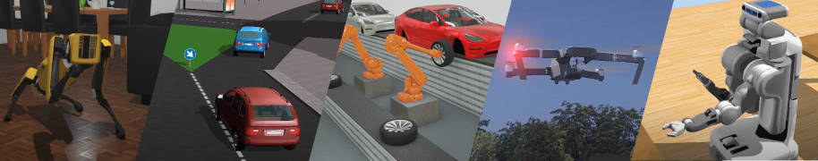

# Webots ROS2 Interface

`webots_ros2` is a package that provides the necessary interfaces to simulate a robot in the [Webots](https://cyberbotics.com/) open-source 3D robots simulator.
It integrates with ROS2 using ROS2 messages, services and actions.

Please visit the [documentation](https://github.com/cyberbotics/webots_ros2/wiki) that contains the following sections:
- [Getting Started](https://github.com/cyberbotics/webots_ros2/wiki/Getting-Started)
- [Examples](https://github.com/cyberbotics/webots_ros2/wiki/Examples)
- [References](https://github.com/cyberbotics/webots_ros2/wiki/References)
- [Tutorials](https://github.com/cyberbotics/webots_ros2/wiki/Tutorials)

## Acknowledgements

 

Supported by ROSIN - ROS-Industrial Quality-Assured Robot Software Components.
More information: <a href="http://rosin-project.eu">rosin-project.eu</a>

This project has received funding from the European Union’s Horizon 2020
research and innovation programme under grant agreement no. 732287.

 

 

Supported by OpenDR - Open Deep Learning Toolkit for Robotics.
More information: <a href="https://opendr.eu/">opendr.eu</a>

This project has received funding from the European Union’s Horizon 2020
research and innovation programme under grant agreement no. 871449.
