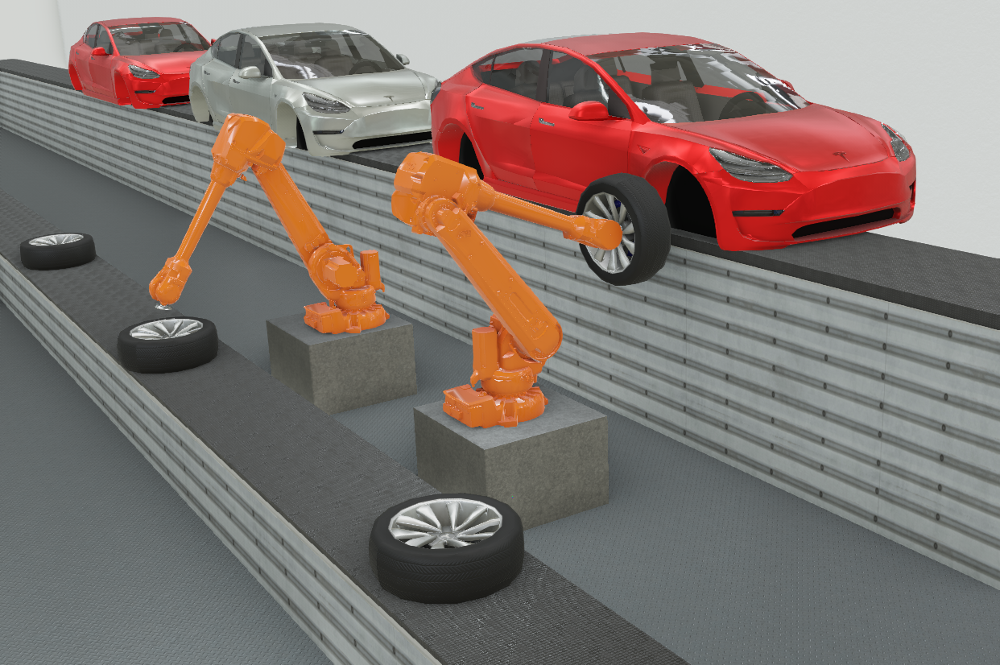

# webots_ros2 ROS2 packages

These packages provide an interface for controlling robots simulated in Webots using ROS2.

All the documentation and tutorials are available on the [ROS wiki](http://wiki.ros.org/webots_ros2).

## Acknowledgement

 

Supported by ROSIN - ROS-Industrial Quality-Assured Robot Software Components.  
More information: <a href="http://rosin-project.eu">rosin-project.eu</a>

  

This project has received funding from the European Union’s Horizon 2020  
research and innovation programme under grant agreement no. 732287. 
