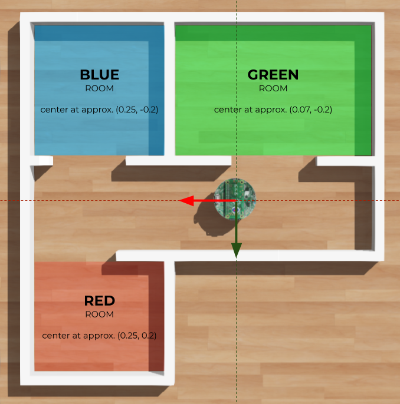

# Rat's Life

Rat's Life is created to quantify the difference between e-puck physical and simulated in mapping, and navigation.
This means you can replicate the map at your home with LEGO bricks and perform the experiment yourself.
The benchmark is highly inspired by the [_The Rat's Life Benchmark: Competing Cognitive Robots_](http://www.vernon.eu/euCognition/NA045-3/PerMIS08_SS1-OMichel.pdf) paper .




## Mapping
Mapping is based on a custom node `simple_mapper,` which only relies on the odometry.
You can launch the mapping with the following command:
```bash
ros2 launch webots_ros2_epuck rats_life_waypoints_launch.py use_sim_time:=true
```

## Navigation
Navigation utilizes the `navigation2` package and pre-built map.
To run the navigation, use the following command:
```bash
ros2 launch webots_ros2_epuck rats_life_launch.py use_sim_time:=true
```
