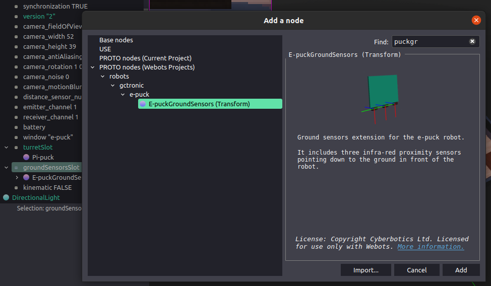

## Run demo

``` 
ros2 launch webots_ros2_epuck example_launch.py
```

and you can use `teleop_twist_keyboard` in another window to control the robot:

``` 
ros2 run teleop_twist_keyboard teleop_twist_keyboard
```

but make sure you have the `teleop-twist-keyboard` ROS package installed.

### Topics Overview
Here you can find a full list of ROS2 topics:
``` 
$ ros2 topic list -t
/cmd_vel [geometry_msgs/msg/Twist]
/gs0 [sensor_msgs/msg/Range]
/gs1 [sensor_msgs/msg/Range]
/gs2 [sensor_msgs/msg/Range]
/image_raw [sensor_msgs/msg/Image]
/camera_info [sensor_msgs/msg/CameraInfo]
/imu [sensor_msgs/msg/Imu]
/led0 [std_msgs/msg/Bool]
/led1 [std_msgs/msg/Int32]
/led2 [std_msgs/msg/Bool]
/led3 [std_msgs/msg/Int32]
/led4 [std_msgs/msg/Bool]
/led5 [std_msgs/msg/Int32]
/led6 [std_msgs/msg/Bool]
/led7 [std_msgs/msg/Int32]
/ls0 [sensor_msgs/msg/Illuminance]
/ls1 [sensor_msgs/msg/Illuminance]
/ls2 [sensor_msgs/msg/Illuminance]
/ls3 [sensor_msgs/msg/Illuminance]
/ls4 [sensor_msgs/msg/Illuminance]
/ls5 [sensor_msgs/msg/Illuminance]
/ls6 [sensor_msgs/msg/Illuminance]
/ls7 [sensor_msgs/msg/Illuminance]
/odom [nav_msgs/msg/Odometry]
/ps0 [sensor_msgs/msg/Range]
/ps1 [sensor_msgs/msg/Range]
/ps2 [sensor_msgs/msg/Range]
/ps3 [sensor_msgs/msg/Range]
/ps4 [sensor_msgs/msg/Range]
/ps5 [sensor_msgs/msg/Range]
/ps6 [sensor_msgs/msg/Range]
/ps7 [sensor_msgs/msg/Range]
/scan [sensor_msgs/msg/LaserScan]
/tf [tf2_msgs/msg/TFMessage]
/tf_static [tf2_msgs/msg/TFMessage]
/tof [sensor_msgs/msg/Range]
```

### Infra-red, Light Sensors, and LEDs
  
E-puck2 has 8 infra-red sensors (named as `ps0-7`) all of which are mapped to the same name ROS2 topics of type [sensor_msgs/Range](https://github.com/ros2/common_interfaces/blob/master/sensor_msgs/msg/Range.msg). Therefore, you can obtain a distance from a sensor as follows:
``` 
ros2 topic echo /ps1
```
Besides infrared sensors, e-puck2 is upgraded with long-range ToF sensor positioned just above the camera. Data from this sensor is also exposed through the [sensor_msgs/Range](https://github.com/ros2/common_interfaces/blob/master/sensor_msgs/msg/Range.msg) topic with name `tof`.

All distance sensors are combined to create [sensor_msgs/LaserScan](https://github.com/ros2/common_interfaces/blob/master/sensor_msgs/msg/LaserScan.msg) so you can use it directly in SLAM packages. You can test it as:
```
ros2 topic echo /scan
```

The same infra-red sensors act as light sensors. In the ROS2 driver, data from the sensors is published as [sensor_msgs/Illuminance](https://github.com/ros2/common_interfaces/blob/master/sensor_msgs/msg/Illuminance.msg) message (unit is lux) and you can subscribe to it as follows:
``` 
ros2 topic echo /ls1
```
Notice in the image above, there are 8 LEDs as well-positioned around the robot. LEDs `led0`, `led2`, `led4` and `led6` can be only turned on or off, while LEDs `led1`, `led3`, `led5` and `led7` have controllable RGB components. Therefore, in the case of binary LEDs, you can test them as:
``` 
ros2 topic pub /led0 std_msgs/Bool '{ "data": true }'
```
and RGB as:
```
ros2 topic pub /led1 std_msgs/Int32 '{ "data": 0xFF0000 }'
```
where 3 lower bytes of Int32 represent 3 bytes of R, G and B components. 

### Velocity
Standard [geometry_msgs/Twist](https://github.com/ros2/common_interfaces/blob/master/geometry_msgs/msg/Twist.msg) topic with name `/cmd_vel` is exposed for velocity control.
``` 
ros2 topic pub /cmd_vel geometry_msgs/Twist "linear:
  x: 0.1
  y: 0.0
  z: 0.0
angular:
  x: 0.0
  y: 0.0
  z: 0.0"
```
> Note that only `linear.x` and `angular.z` are considered as e-puck2 is differential wheeled robot.

### Odometry
Standard ROS2 messages [nav_msgs/Odometry](https://github.com/ros2/common_interfaces/blob/master/nav_msgs/msg/Odometry.msg) are used to publish odometry data. You can subscribe to it with:
``` 
ros2 topic echo /odom
```
In case you are not interested in covariance matrices, you can use `--no-arr` parameter to hide arrays:
```
ros2 topic echo --no-arr /odom
```

> Note that ROS uses [REP](https://www.ros.org/reps/rep-0103.html) convention (x-forward, y-left and z-up) while Webots inherited convention from [VRML](https://en.wikipedia.org/wiki/VRML) (x-right, y-up, z-backward). Therefore, you will see translations in Webots as following ,  and .

You can also visualise odometry in `rviz` :

``` 
ros2 launch webots_ros2_epuck example.launch.py rviz:=true
```

### Camera
Camera data and details are described through `image_raw` (type [sensor_msgs/Image](https://github.com/ros2/common_interfaces/blob/master/sensor_msgs/msg/Image.msg)) and `camera_info` (type [sensor_msgs/CameraInfo](https://github.com/ros2/common_interfaces/blob/master/sensor_msgs/msg/CameraInfo.msg)) topics. Compared to the physical robot driver there is no [sensor_msgs/CompressedImage](https://github.com/ros2/common_interfaces/blob/master/sensor_msgs/msg/CompressedImage.msg) since the images are not meant to be transfer thourgh a network. 

You can run `rqt` , navigate to `Plugins > Visualization > Image View` and for topic choose `/image_raw`. Note that the image encoding is BGRA.

### IMU
There are 3D accelerometer and 3D gyro hardware on e-puck2. You can access to this data through `imu` topic (type [sensor_msgs/Imu](https://github.com/ros2/common_interfaces/blob/master/sensor_msgs/msg/Imu.msg)), e.g.:
```
ros2 topic echo --no-arr /imu
```

### Ground Sensors
Ground sensors come as an [optional module](http://www.e-puck.org/index.php?option=com_content&view=article&id=17&Itemid=18) for e-puck2. If the module is present, the ROS2 driver will automatically detect it and publish data. You can test them as:
``` 
ros2 topic echo /gs1
```
To put the ground sensor module, select `groundSensorsSlot` in `e-puck2` robot tree, click `+` button and find `E-puckGroundSensors` (check the image bellow).


### Transformations
Dynamic transformations are only used for the odometry and you can show it as:
```
ros2 topic echo tf
```

All other transformations are static and they are exposed as latched topics, so you show them with the following command:
```
ros2 topic echo --qos-profile services_default --qos-durability transient_local tf_static
```