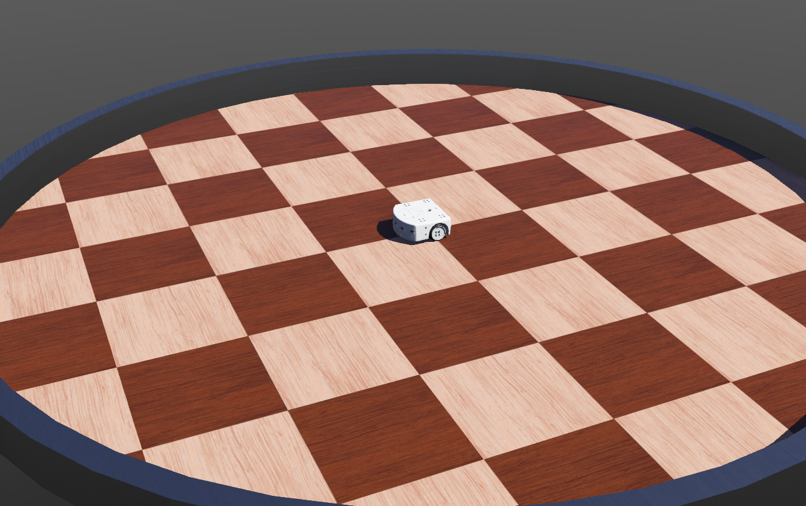
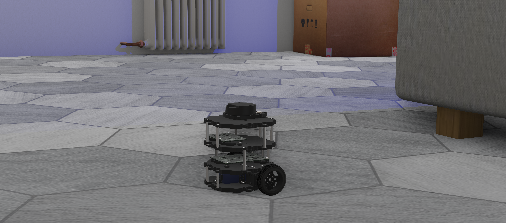
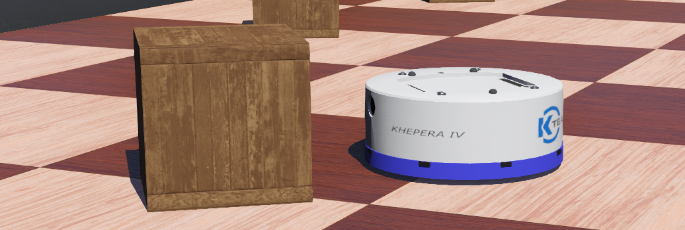

# webots_ros2_examples

In this package you can find a collection of simple examples.

## Thymio II

This package provides a very simple ROS2 node, launch file and simulation for Thymio II robot. It is a good starting point to create your own simulation and ROS2 interface with your own simulated robot.

### Launching the Simulation
The package includes a launch file that will start Webots and the node that interfaces Webots and ROS2. This launch file can be called like this:

```bash
ros2 launch webots_ros2_examples example.launch.py
```

Webots will start with the Thymio II differential wheel robot and the `example_controller` node will start.
This node acts as a Webots robot controller and publishes the value of the front distance-sensors of the robot on the `/sensor` topic and provides the `/motor` topic which can be used to change the speed of each wheel of the robot.

To quit the simulation and stop the launch file, you simply need to close Webots.

### Interact with the Robot

#### Move the Robot
The `/motor` service can be tested directly using the [ROS2 service CLI interface](https://index.ros.org/doc/ros2/Tutorials/Introspection-with-command-line-tools) to move the robot:

```bash
ros2 service call /motor webots_ros2_msgs/SetDifferentialWheelSpeed "{ left_speed: 1.0, right_speed: 0.5 }"
```

#### Display the Sensor Value
The output of the sensor (`/sensor` topic) can be displayed directly using the [ROS2 topic CLI interface](https://index.ros.org/doc/ros2/Tutorials/Introspection-with-command-line-tools)

```bash
ros2 topic echo /sensor
```

#### Troubleshooting

If you see import failures or some indications saying that `WEBOTS_HOME` is incorrectly set, make sure your environment variables are [configured for extern controllers](https://www.cyberbotics.com/doc/guide/running-extern-robot-controllers?version=master#environment-variables).


## TurtleBot3 Burger



To run the TurtleBot3 Burger simulation you can use the universal launcher:
```bash
ros2 launch webots_ros2_core robot_launch.py \
    executable:=webots_differential_drive_node \
    node_parameters:=$(ros2 pkg prefix webots_ros2_examples --share)/resource/turtlebot3_burger.yaml \
    world:=$(ros2 pkg prefix webots_ros2_examples --share)/worlds/turtlebot3_burger_example.wbt
```

If you have [`turtlebot3`](https://github.com/ROBOTIS-GIT/turtlebot3) package installed you can start `cartographer` as (you may need to run the command twice if it fails the first time):
```bash
ros2 launch turtlebot3_cartographer cartographer.launch.py \
    use_sim_time:=true
```

Also, you can start `navigation2` using a custom map:
```bash
export TURTLEBOT3_MODEL='burger'
ros2 launch turtlebot3_navigation2 navigation2.launch.py \
    use_sim_time:=true \
    map:=$(ros2 pkg prefix webots_ros2_examples --share)/resource/turtlebot3_burger_example_map.yaml
```

Make sure you set the initial pose by clicking `2D Pose Estimate` button in RViz or by executing the following command:
```bash
ros2 topic pub --once /initialpose geometry_msgs/msg/PoseWithCovarianceStamped '{
    "header": { "frame_id": "map" },
    "pose": {
        "pose": {
            "position": { "x": 0.0, "y": 0.0, "z": 0.0 },
            "orientation": { "x": 0.0, "y": 0.0, "z": 0.0, "w": 1.0 }
        }
    }
}'
```

> On the [official TurtleBot3 website](https://emanual.robotis.com/docs/en/platform/turtlebot3/overview/#turtlebot3) you can find more information about [navigation](https://emanual.robotis.com/docs/en/platform/turtlebot3/ros2_navigation2/) and [SLAM](https://emanual.robotis.com/docs/en/platform/turtlebot3/ros2_slam/) configuration.

This will expose necessary topics:
```bash
$ ros2 topic list -t
/scan [sensor_msgs/msg/LaserScan]
/cmd_vel [geometry_msgs/msg/Twist]
/imu [sensor_msgs/msg/Imu]
/joint_states [sensor_msgs/msg/JointState]
/odom [nav_msgs/msg/Odometry]
/robot_description [std_msgs/msg/String]
/tf [tf2_msgs/msg/TFMessage]
/tf_static [tf2_msgs/msg/TFMessage]
```

## Khepera IV



Similarly to the TurtleBot3 Burger you can start the Khepera IV robot as well:
```bash
ros2 launch webots_ros2_core robot_launch.py \
    executable:=webots_differential_drive_node \
    node_parameters:=$(ros2 pkg prefix webots_ros2_examples --share)/resource/khepera4.yaml \
    world:=$(ros2 pkg prefix webots_ros2_examples --share)/worlds/khepera4_example.wbt
```

Or, if you want to have [`sensor_msgs/LaserScan`](https://github.com/ros2/common_interfaces/blob/master/sensor_msgs/msg/LaserScan.msg) topic you have to use a custom driver:
```bash
ros2 launch webots_ros2_core robot_launch.py \
    executable:=khepera_driver \
    package:=webots_ros2_examples \
    node_parameters:=$(ros2 pkg prefix webots_ros2_examples --share)/resource/khepera4.yaml \
    world:=$(ros2 pkg prefix webots_ros2_examples --share)/worlds/khepera4_example.wbt
```
