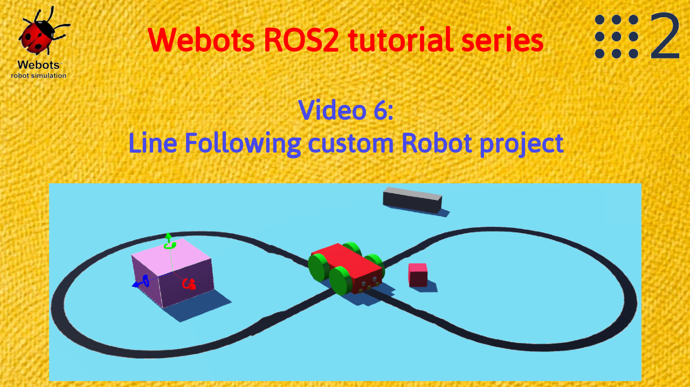
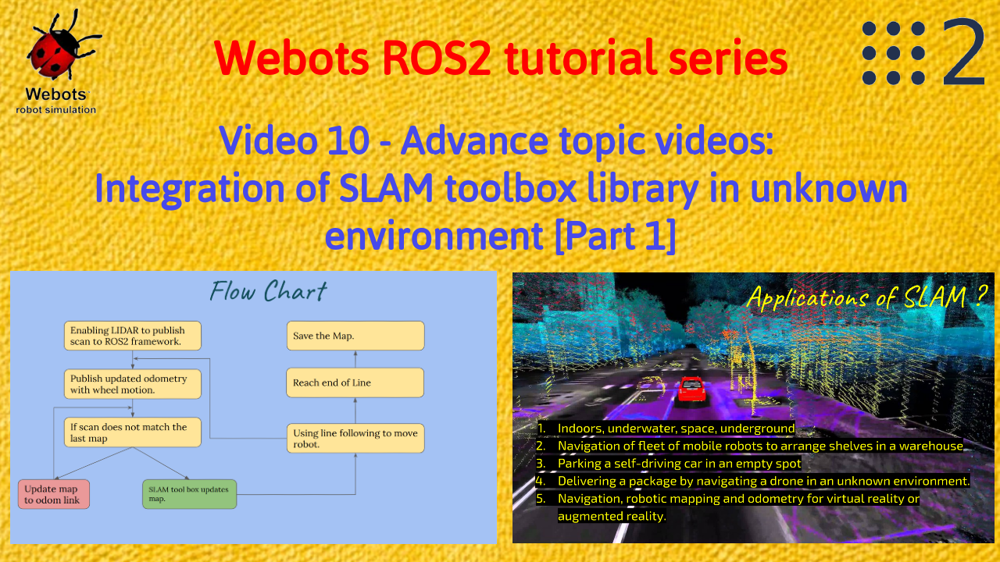

# [Line Following Custom Robot](https://www.youtube.com/watch?v=ZTJa5f5F5fU)
This [6th video](https://www.youtube.com/watch?v=ZTJa5f5F5fU) in the [Webots-ROS YouTube Tutorial Series](https://www.youtube.com/watch?v=jU_FD1_zAqo&list=PLt69C9MnPchkP0ZXZOqmIGRTOch8o9GiQ) implements the concept of a master and slave where the master publishes messages on a topic and the slave subscribes to them.  Here a custom robot is made to follow a line. 3 sensors in front of the robot detect the color below it, using which we know the difference between the black and the blue color to make sure that the robot follows the black color. Using `rqt_graph` (visualization of nodes and topics) we can see that the master node subscribes to the sensor topics and does calculations and publishes to `/cmd_vel` topic which gets subscribed to by the slave node. Here the slave node acts as the bridge between Webots and ROS2 and the master node is like the brain written in ROS2.
The launch file structure in ROS2 has also been explained in the video which includes the package and core directory. This is the `robot_launch` file which also has the package and the executable names. 
<p align="center"></p>

### Build the project using:
`colcon build`
### Launch the project using: 
``ros2 launch webots_ros2_tutorial line_following.launch``

``ros2 topic list`` shows the list of all topics. 

``ros2 topic echo /topic_name`` can be used to subscribe to an topic.

# [Implementation of SLAM toolbox in an unknown environment](https://youtu.be/3Ak3KoNhfv0)
This includes the [10th video](https://youtu.be/3Ak3KoNhfv0) and the [11th video](https://youtu.be/3Ak3KoNhfv0) in the [Webots-ROS YouTube Tutorial Series](https://www.youtube.com/watch?v=jU_FD1_zAqo&list=PLt69C9MnPchkP0ZXZOqmIGRTOch8o9GiQ)
This [SteveMacenski's SLAM toolbox github repo](https://github.com/SteveMacenski/slam_toolbox) is used to study about the SLAM toolbox package. It includes different services and plugins for Rviz2 for working with this package.

### Command to install SLAM toolbox :
```
apt install ros-foxy-slam-toolbox
```
This project based on SLAM generates a final map in RViz2 which matches that of the Webots world. It gives the viewers a god understanding of concepts such as odometry, localization and mapping. Here the robot is navigated using keyboard or joystick commands. Once the robots starts to move, it’s scan and odometry is taken by the slam node and a map is published which can be seen in RViz2. The project algorithm also shifts odometry with respect to map in order of match the scan with the map. Hence we get a consistent map. A lidar is added to the custom robot so that it is able to publish the scan. Other sensors like distance sensor and wheels made use of in the project have been described and enabled in the videos. The need to publish odometry and transform between odom and base_link in order to use SLAM toolbox to generate and correct the map has also been explained. The master node used here is similar to the one used in the Line Following Robot project. It is used to generate `cmd_vel` depending on the readings of the sensor. SLAM configuration is performed in order to facilitate publishing and update of the map and accordingly change transform between `map` and `odom` link by matching the laser scan with the generated occupancy grip. Hence it truly does localization at each step before adding points in the occupancy grid that are mapping. ROS2 framework is used and hence we see how to setup different world files, protos, and launch file in the setup.py. The final launch file has 2 parts: In the first part we use an inbuilt Webots framework to call the world and call files to enable all the sensors and wheels in the custom robot. In the second part we make a node for line following logic. This node takes in IR sensor readings and processes the data. Finally it spits out `cmd_vel` which can be used by robot for navigation.
<p align="center"></p>

### Build the project:
``
cd ~/ros_ws/ 
colcon build
source install/setup.bash
``
The colcon build builds all the packages in the repository. 
Sourcing the package is a mandatory step so that ROS2 can register all the packages in the repository.
### Run the project:
On first terminal:
```
cd ~/ros2_ws/src/webots_ros2/webots_ros2_tutorials/config/
ros2 run slam_toolbox async_slam_toolbox_node  --ros-args --param use_sim_time:=true --params-file slam_config.yaml
```
On second terminal:
```
cd ~/ros2_ws
ros2 launch webots_ros2_tutorials slam_toolbox_launch.py
```
On third terminal:
```
rviz2
``` 
If you want the same configuration as in the video you can load it from the `rviz` folder.

### Save the map
In order to save the map, close the terminal with the `slam_toolbox_launch` and then run the following:
```
ros2 run nav2_map_server map_saver_cli -t map
```
#  [Implementation of AR-tag detection and getting exact pose from camera. (Integration of OpenCV)](https://youtu.be/iLwpk1mSxKM)
### Build the project: 
```
cd ~/AR_ws/ 
colcon build
source install/setup.bash
```
The reason to build the packages and source has already been explained above.

### Run the project:
```
ros2 launch webots_ros2_tutorials ar_detection_launch.py
```
