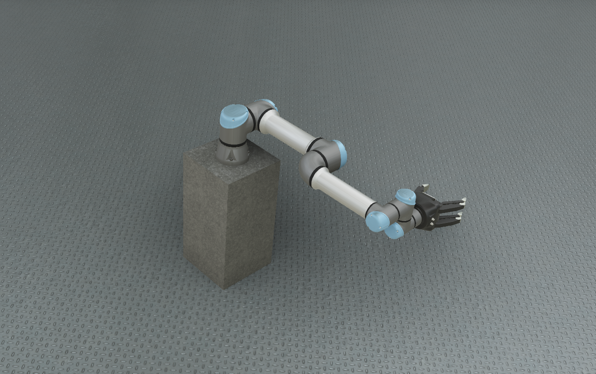
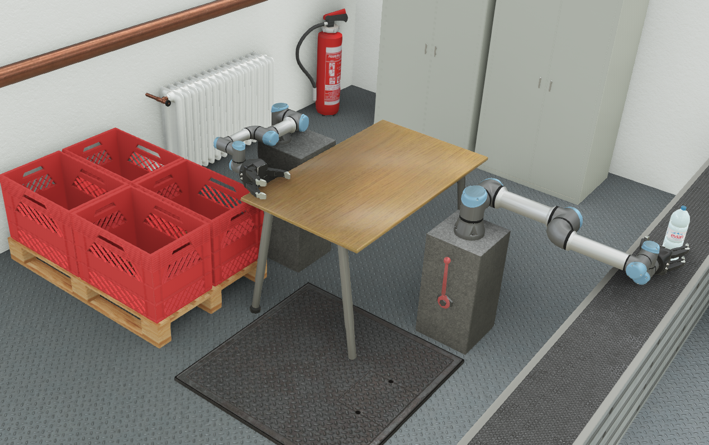

# webots_ros2_universal_robot

This package provides an interface between ROS2 and the [UR3e, UR5e and UR10e simulation models](https://cyberbotics.com/doc/guide/ure) of the [Universal Robots](https://www.universal-robots.com) running in Webots.
It includes several simulations of these robots.

## universal_robot Node

This node acts as a Webots robot controller.
It publishes the `/joint_states` topic that represents the state of all the joints of the robot.
And it provides the `/follow_joint_trajectory` action server that allows you to send joint trajectory action to the robot.

## Samples Simulations

The following simulations are provided within this package:

### universal_robot

This simulation can be started with the following launch file:
```
ros2 launch webots_ros2_universal_robot universal_robot.launch.py
```


This simulation contains one UR5e robot in a very simple environment.

### universal_robot_rviz_dynamic

This simulation uses a new Webots feature to export URDF.
Therefore, you will be able to change the robot model in Webots and to see the changes in RViz.

```
ros2 launch webots_ros2_universal_robot universal_robot_rviz_dynamic.launch.py
```

> Note that the visual elements are still not supported, only the transforms will be shown.

### universal_robot_multiple

This simulation can be started with the following launch file:
```
ros2 launch webots_ros2_universal_robot universal_robot_multiple.launch.py
```


This simulation contains a UR3e and a UR5e robot in a simple factory environment.
This is a very good example showcasing how to use the multi-robots support with the Webots-ROS2 interface.


### universal_robot_lidar

This world contains UR5e robot with 3D LiDAR.

```bash
ros2 launch webots_ros2_core robot_launch.py \
    executable:=webots_robotic_arm_node \
    world:=$(ros2 pkg prefix webots_ros2_universal_robot --share)/worlds/universal_robot_lidar.wbt
```

## Interact with the Robot
### Move the Robot
The `/follow_joint_trajectory` action server can be tested directly using the [ROS2 action CLI](https://index.ros.org/doc/ros2/Tutorials/Introspection-with-command-line-tools) interface to move the robot (if more than one robot is present in the simulation, the action name should be changed, e.g. `/UR3e/follow_joint_trajectory`):
```
ros2 action send_goal /follow_joint_trajectory control_msgs/action/FollowJointTrajectory "{
  trajectory: {
    joint_names: [shoulder_pan_joint, shoulder_lift_joint, elbow_joint, wrist_1_joint, wrist_2_joint, wrist_3_joint],
    points: [
      { positions: [3.02, -1.63, -1.88, 1.01, 1.51, 1.13], velocities: [0.1, 0.1, 0.1, 0.1, 0.1, 0.1], accelerations: [0.1, 0.1, 0.1, 0.1, 0.1, 0.1], time_from_start: { sec: 5, nanosec: 500 } },
      { positions: [-1.01, 0.38, -0.63, -0.88, 0.25, -1.63], velocities: [0.1, 0.1, 0.1, 0.1, 0.1, 0.1], accelerations: [0.1, 0.1, 0.1, 0.1, 0.1, 0.1], time_from_start: { sec: 6, nanosec: 500 } },
      { positions: [-1.01, 0.38, -0.63, -0.88, 0.25, 6.2], velocities: [0.1, 0.1, 0.1, 0.1, 0.1, 0.1], accelerations: [0.1, 0.1, 0.1, 0.1, 0.1, 0.1], time_from_start: { sec: 50, nanosec: 500 } }
    ]
  },
  goal_tolerance: [
    { name: shoulder_pan_joint, position: 0.01 },
    { name: shoulder_lift_joint, position: 0.01 },
    { name: elbow_joint, position: 0.01 },
    { name: wrist_1_joint, position: 0.01 },
    { name: wrist_2_joint, position: 0.01 },
    { name: wrist_3_joint, position: 0.01 }
  ]
}"
```

### Display the Joint State
The joint state (`/joint_states` topic) can be displayed directly using the [ROS2 topic CLI](https://index.ros.org/doc/ros2/Tutorials/Introspection-with-command-line-tools) interface (if more than one robot is present in the simulation, the action name should be changed, e.g. `/UR3e/joint_states`):
```
ros2 topic echo /joint_states
```